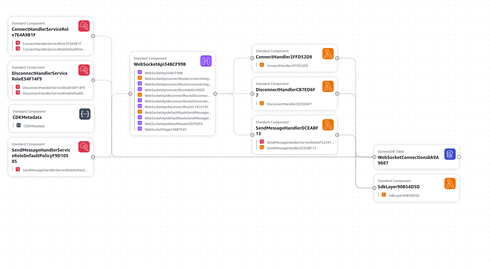

# Hotel Booking — AWS CDK Infrastructure

CDK v2 (TypeScript) infrastructure for real-time WebSocket notifications.

## Architecture



```
┌──────────────────┐        ┌─────────────────────┐        ┌───────────────────┐
│   Next.js App    │◄──────►│  API Gateway WS API  │◄──────►│  Lambda Handlers   │
│   (Frontend)     │  WSS   │  wss://.../dev       │  invoke │  connect/disconnect│
│                  │        │                      │        │  sendMessage       │
└──────────────────┘        └─────────────────────┘        └─────────┬─────────┘
                                                                      │
                                                                      ▼
                                                           ┌───────────────────┐
                                                           │  DynamoDB          │
                                                           │  WebSocketConn-    │
                                                           │  ections (TTL 24h)  │
                                                           │  PK: connectionId   │
                                                           │  GSI: userId        │
                                                           └───────────────────┘
```

### Flow

1. **Connect**: Client opens WebSocket → `$connect` Lambda stores `connectionId ↔ userId` in DynamoDB
2. **Send**: Next.js API route calls `awsWebSocketService.sendMessageToUser()` → POSTs to `sendMessage` Lambda route → Lambda looks up `userId → connectionId` in DynamoDB → pushes message via API Gateway Management API
3. **Disconnect**: Client closes WebSocket → `$disconnect` Lambda removes the DynamoDB entry
4. **TTL**: Stale connections (e.g., server crash without disconnect) auto-expire after 24 hours

## Prerequisites

- Node.js ≥ 18
- pnpm (used across the project)
- AWS CLI configured with credentials (`aws configure`)
- AWS account bootstrapped for CDK (`pnpm run bootstrap`)

## Setup

```bash
cd packages/cdk-infra

# Install dependencies (also builds the SDK Lambda layer)
pnpm install

# (Optional) Bootstrap the AWS account (first time only)
pnpm run bootstrap
```

## Deployment

```bash
# Deploy to dev stage
pnpm run deploy:dev

# Or deploy with custom stage
CDK_STAGE=staging pnpm run deploy WebSocketNotificationStack-staging

# View what will change before deploying
pnpm run diff
```

### After deployment

CDK will output the following values — add them to your root `.env`:

```env
WEBSOCKET_API_URL=https://<api-id>.execute-api.ap-southeast-1.amazonaws.com/dev
NEXT_PUBLIC_WEB_SOCKET_URL=wss://<api-id>.execute-api.ap-southeast-1.amazonaws.com/dev
```

## Teardown

```bash
# Destroy all resources
pnpm run destroy
```

## Project Structure

```
packages/cdk-infra/
├── bin/
│   └── app.ts              # CDK app entry point
├── lib/
│   └── websocket-stack.ts   # CloudFormation stack (API GW, Lambda, DynamoDB)
├── lambda/
│   ├── connect/
│   │   └── index.ts         # $connect handler — stores connection in DynamoDB
│   ├── disconnect/
│   │   └── index.ts         # $disconnect handler — removes connection
│   └── sendMessage/
│       └── index.ts         # sendMessage handler — pushes to target user
├── layer/
│   └── sdk/
│       └── nodejs/          # Lambda Layer with AWS SDK v3 bundles
├── cdk.json
├── package.json
└── tsconfig.json
```

## Environment Variables

| Variable | Required | Description |
|---|---|---|
| `AWS_ACCESS_KEY_ID` | Yes | AWS access key |
| `AWS_SECRET_ACCESS_KEY` | Yes | AWS secret key |
| `AWS_REGION` | No | Region (default: `ap-southeast-1`) |
| `CDK_STAGE` | No | Deployment stage (default: `dev`) |

## Integration with Next.js

The Next.js application integrates with the CDK-deployed WebSocket infrastructure using both server-side dispatching and client-side listener providers.

No `@aws-sdk` dependencies are needed in the Next.js app — all AWS SDK usage is encapsulated within the Lambda layer.

### Server-side Notification Dispatching
* **Service** (`services/awsWebSocket.ts`): POSTs payload messages to the `sendMessage` Lambda route via the API Gateway endpoint when trigger events (e.g. new bookings, updates) occur.

### Client-side WebSocket Connection Handling
The frontend manages WebSocket connections dynamically using React Context and the native browser `WebSocket` API defined in [webSocketProvider.tsx](file:///home/thz/Desktop/projects/hotel_booking/providers/webSocketProvider.tsx).

#### 1. Lifecycle & Connection Management
* **Persistent Connection Ref**: The WebSocket instance is stored in a React Ref (`ws = useRef<WebSocket | null>(null)`) to prevent connection resets during component re-renders.
* **Authentication-driven connection**: The connection is automatically established once a user is authenticated (`session?.user?.id` and `status === "authenticated"`).
* **Connection parameters**: It appends the user's ID as a query parameter (`?userId=<id>`) to the WebSocket URL for authorization and routing.
* **Auto-cleanup**: Closes the socket connection and clears any pending reconnection timers when the provider unmounts or the user session changes.

#### 2. Reconnection & Recovery
* Handles unexpected disconnects in the `onclose` handler.
* Attempts automatic reconnection up to **5 times** (`MAX_RECONNECT_ATTEMPTS`) with a **3-second delay** (`RECONNECT_DELAY`) for non-clean closures (`!event.wasClean`).

#### 3. Message Processing & UI Updates
* **React Query Cache Synchronization**: When a `"sendNotification"` action is received, it immediately updates the `notificationsQueryKey` query cache, updating notification badges dynamically without requiring a manual server refetch.
* **Toast Notification Rate Limiting**: Displays a user-facing toast alert with the message, rate-limited using a **3-second deduplication window** (`TOAST_DEDUP_MS`) to prevent spamming.

#### 4. Outbound Notifications
* Uses a hybrid, fire-and-forget approach for `sendNotification`:
  * Saves notifications via REST API helpers (`saveNotificationToAdmins` or `saveNotification`).
  * Optimistically updates the local React Query cache state.
  * Wrapped in `try...catch` so notification network issues do not interrupt core booking flows.
